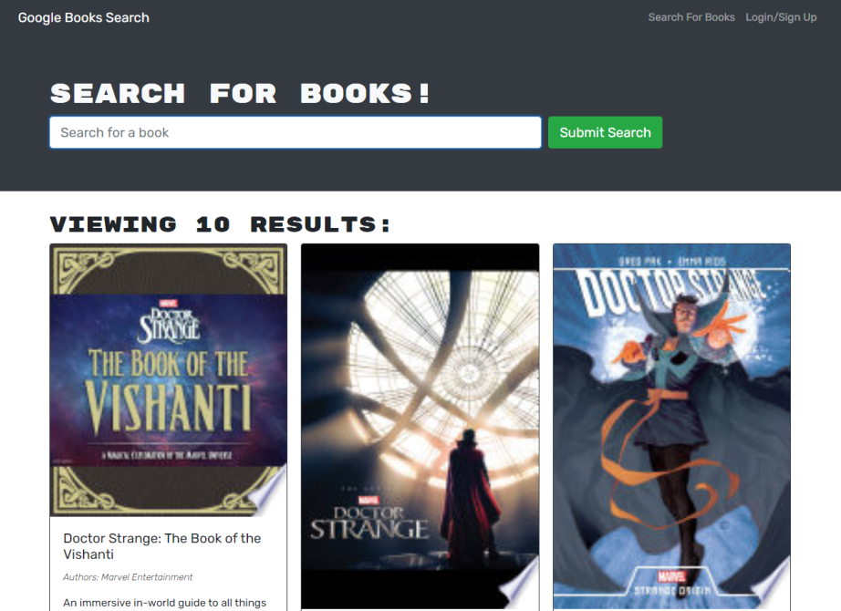

# Book Search Engine

This is a google books API search engine that uses RESTful API and altered into GraphQL API that uses Apollo server. This is a MERN stack which uses Mongo, Express, React, and Node.

Refactoring Restful APIs to GraphQL APIs with Apollo server.

[MIT](https://choosealicense.com/licenses/mit/)

-----
## Screenshot

------
## Questions

_Reach Out!_

Github: [TDGNate](https://github.com/TDGNate)

Email: itsnzte@gmail.com
